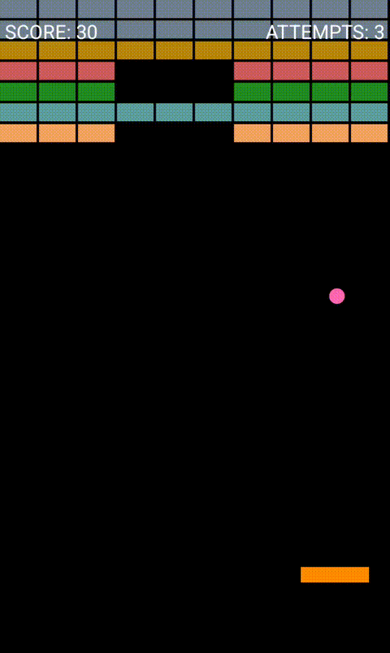

# Bricks Game

Bricks is a classic brick breaker arcade game for Android. Control the paddle, bounce the ball, and clear all the bricks to advance through challenging levels. The game features simple touch controls and a minimalist 2D design.



## Features
- Classic brick breaker gameplay
- Touch controls optimized for Android devices
- Minimalist 2D graphics
- Adaptive portrait layout for phones and tablets
- Score and attempts tracking

## Installation

To build and run the app from source, follow these steps:

1. **Clone the repository:**
   ```sh
   git clone https://github.com/tkdesign/Bricks.git
   ```
2. **Open the project in [Android Studio](https://developer.android.com/studio):**
   - File > Open > Select the project folder
3. **Build and run the app:**
   - Connect your Android device or use an emulator
   - Click the Run button in Android Studio

## Requirements
- Android Studio (latest recommended)
- Android device or emulator (API level 30+, Android 11+)

## Technical Details
- Language: Java
- Target platform: Android (phones and tablets)
- Minimum SDK: 30 (Android 11)
- Target SDK: 34 (Android 14)
- Portrait orientation only
- Adaptive UI for different screen sizes
- No external dependencies

## License

This project is licensed under the MIT License. See the [LICENSE](LICENSE) file for details.

---

Author: Petr Kovalenko
